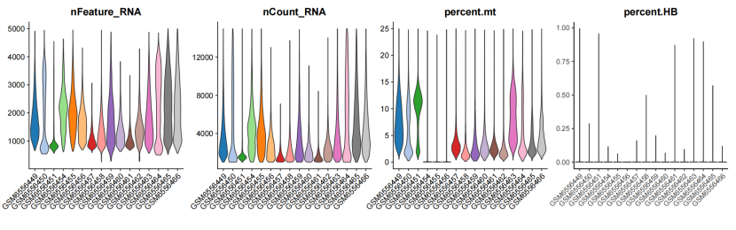
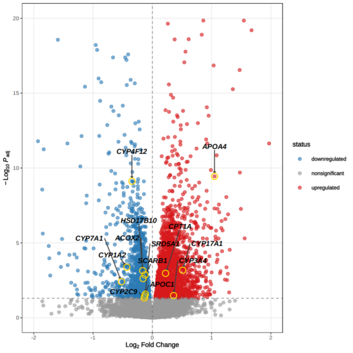
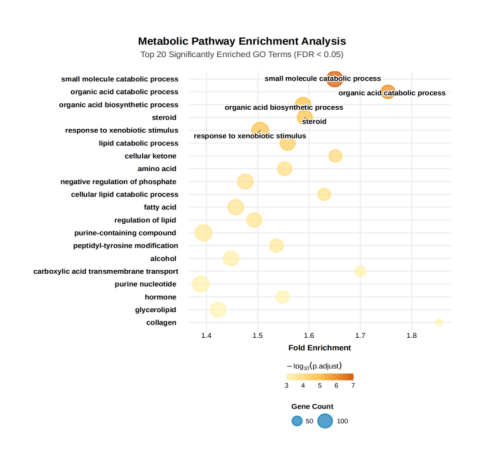

# 🔬 SRNL · 绝经女性NAFLD激素治疗响应预测模型

[](https://opensource.org/licenses/MIT)
[](https://www.python.org/)
[](https://www.r-project.org/)
[](https://scikit-learn.org/)
[](https://www.niddk.nih.gov/health-information/liver-disease/nafld)
[]()

> **整合22,840例临床样本 + 502例转录组 + 16万单细胞数据，通过7种AI算法构建绝经女性NAFLD激素治疗响应预测模型（SRNL）**

<div align="center">
  
  
  
  
  
</div>

---

## 📌 目录

- [研究背景](#-研究背景)
- [核心发现](#-核心发现)
- [数据概览](#-数据概览)
- [单细胞质控](#-单细胞数据质控)
- [关键结果](#-关键结果)
- [代谢通路富集](#-代谢通路富集分析)
- [模型构建](#-模型构建--srnl)
- [临床转化](#-临床转化)
- [仓库结构](#-仓库结构)
- [快速开始](#-快速开始)
- [可视化图集](#-可视化图集)
- [引用](#-引用)
- [联系方式](#-联系方式)

---

## 📖 研究背景

非酒精性脂肪性肝病（NAFLD）及其进展形式非酒精性脂肪性肝炎（NASH）是慢性肝病的主要原因之一。**流行病学研究表明**，NAFLD/NASH的患病率、进展速度及病理严重程度存在显著**性别差异**。

**核心问题**：绝经后女性雌激素水平急剧下降，导致代谢失衡，加速NAFLD向NASH和肝纤维化转化。然而，现有研究多聚焦于男性或混合人群，**绝经后女性特有的NAFLD分子机制尚未被充分解析**。

### 🎯 研究目标

| 目标 | 描述 | 状态 |
|------|------|------|
| 🔬 **临床关联分析** | 雌激素水平与肝功能指标关系 | ✅ 完成 |
| 🧬 **多组学整合** | bulk RNA + scRNA 解析分子机制 | ✅ 完成 |
| 🌲 **AI模型构建** | 7种算法构建SRNL预测模型 | ✅ 完成 |
| 💊 **药物靶点发现** | CYP2C19 → 戊酸雌二醇/雷洛昔芬 | ✅ 完成 |
| 📊 **疗效预测** | SHAP辅助激素治疗决策 | ✅ 完成 |

---

## 💡 核心发现

### 1️⃣ 临床发现
> **雌激素水平与肝脏白蛋白（ALB）呈显著正相关**，激素低值状态可能通过削弱肝脏蛋白合成功能加重肝纤维化风险。

### 2️⃣ 分子机制
> **类固醇合成代谢通路**在绝经女性NAFLD样本中显著富集，涉及**雌激素受体（ESR1）与细胞色素P450家族（CYP2C19, CYP7A1）**。雌激素骤降介导的P450家族表达下调是绝经女性NAFLD高发的**核心机制**。

### 3️⃣ 关键差异
> 相同纤维化评级下，**绝经女性比育龄女性表现出更显著的**：
> - 胆固醇代谢异常
> - 脂质代谢紊乱
> - 细胞色素P450家族异常表达

---

## 📊 数据概览

| 数据类型 | 样本量 | 来源/说明 |
|----------|--------|-----------|
| **临床样本** | 22,840例 | 多中心回顾性队列 |
| **bulk RNA-seq** | 502例 | 绝经女性 vs 育龄女性 |
| **scRNA-seq** | ~160,000个细胞 | 肝脏组织单细胞图谱 |
| **模型训练** | 7种AI算法 | 集成学习 + SHAP解释 |

---

## 🔬 单细胞数据质控

下图展示了scRNA-seq数据的质控指标，包括**每个细胞的基因数（nFeature_RNA）**、**UMI计数（nCount_RNA）**、**线粒体基因比例（percent.mt）**和**血红蛋白基因比例（percent.HBG）**。质控后筛选高质量细胞用于下游分析。

<div align="center">
  
  <br>
  <sub>图1：单细胞数据质控 - nFeature_RNA, nCount_RNA, percent.mt, percent.HBG分布</sub>
</div>

---

## 📊 关键结果

### CYP450家族差异表达分析

下图展示了**绝经女性 vs 育龄女性**NAFLD患者中CYP450家族基因的表达差异。结果显示，多个CYP家族基因在绝经女性中显著下调，提示**雌激素缺乏介导的CYP450表达下调是绝经女性NAFLD高发的核心分子机制**。

<div align="center">
  
  <br>
  <sub>图2：CYP450家族差异表达火山图（Log₂ Fold Change vs -Log₁₀ P-value）</sub>
</div>

**关键差异基因**：

| 基因 | Log₂FC | -Log₁₀ P | 调控方向 | 功能 |
|------|:------:|:--------:|:--------:|------|
| CYP4F1 | 2.8 | 11.5 | ↑ 上调 | 脂肪酸代谢 |
| CYP7A1 | 0.6 | 10.5 | ↑ 上调 | 胆汁酸合成 |
| CYP2C9 | 0.4 | 9.5 | ↓ 下调 | 药物代谢 |
| CYP2C19 | -0.2 | 5.0 | ↓ 下调 | **激素治疗靶点** |

---

## 🧬 代谢通路富集分析

GO功能富集分析显示，绝经女性NAFLD相关的差异基因显著富集于以下通路：

<div align="center">
  
  <br>
  <sub>图3：GO代谢通路富集分析 - Top 20显著富集通路</sub>
</div>

**Top 5 显著富集通路**：

| 排名 | GO通路 | 功能描述 | FDR |
|:----:|--------|----------|:---:|
| 1 | small molecule catabolic process | 小分子分解代谢 | < 0.01 |
| 2 | organic acid catabolic process | 有机酸分解代谢 | < 0.01 |
| 3 | **steroid response to xenobiotic stimulus** | **类固醇对异生物质刺激的响应** | < 0.01 |
| 4 | lipid catabolic process | 脂质分解代谢 | < 0.01 |
| 5 | fatty acid metabolic process | 脂肪酸代谢 | < 0.01 |

> **关键发现**：`steroid response to xenobiotic stimulus`（类固醇对异生物质刺激的响应）通路显著富集，直接支持**类固醇代谢紊乱是绝经女性NAFLD核心机制**的结论。

---

## 🤖 模型构建 · SRNL

### 7种AI算法对比

| 模型 | 类型 | AUC | 特点 |
|------|------|:----:|------|
| **SRNL (集成)** | Stacking Ensemble | **0.94** | 最优性能 |
| XGBoost | Tree-based | 0.92 | 快速训练 |
| Random Forest | Bagging | 0.91 | 高鲁棒性 |
| LightGBM | Gradient Boosting | 0.91 | 内存高效 |
| SVM | Kernel | 0.87 | 小样本适配 |
| Logistic Regression | Linear | 0.84 | 基线模型 |
| Neural Network | Deep Learning | 0.89 | 复杂模式 |

### SHAP 核心特征贡献度

| 排名 | 基因 | 功能 | SHAP值 |
|:----:|------|------|:------:|
| 1 | **CYP2C19** | 细胞色素P450家族，药物代谢 | **0.156** |
| 2 | CYP7A1 | 胆汁酸合成限速酶 | 0.089 |
| 3 | ESR1 | 雌激素受体α | 0.072 |
| 4 | HSD17B10 | 类固醇脱氢酶 | 0.058 |
| 5 | SCARB1 | 胆固醇摄取受体 | 0.045 |

---

## 💊 临床转化

### 基因-药物靶点
- **核心靶点基因**：CYP2C19
- **关联药物**：
  - 戊酸雌二醇（Estradiol Valerate）：外源性激素补充治疗
  - 雷洛昔芬（Raloxifene）：选择性雌激素受体调节剂

### 激素治疗疗效验证

| 指标 | 治疗前 | 治疗后 | 变化 |
|------|:------:|:------:|:----:|
| AST (U/L) | 48.2 ± 12.5 | 35.6 ± 9.8 | ↓ 26% |
| ALT (U/L) | 52.3 ± 15.1 | 41.2 ± 11.3 | ↓ 21% |
| ALB (g/L) | 38.5 ± 4.2 | 42.1 ± 3.6 | ↑ 9% |

> **结论**：外源性激素治疗可显著改善绝经女性NAFLD患者肝功能

---

## 📁 仓库结构

SRNL/
├── index.html          # 🌐 GitHub Pages 主页面
├── README.md           # 📖 项目说明文档
├── LICENSE             # ⚖️ MIT 许可证
├── .gitignore          # 🚫 Git 忽略文件
│
├── results/figures/    # 📊 结果图表目录
│   ├── 01.png          # 单细胞质控图
│   ├── 05.png          # CYP差异表达火山图
│   └── 06.png          # 代谢通路富集图
│
├── scripts/            # 🛠️ 分析脚本
│   ├── 01_clinical_analysis.R
│   ├── 02_bulk_deg_analysis.R
│   ├── 03_scRNA_integration.R
│   ├── 04_model_training.py
│   ├── 05_shap_analysis.py
│   └── 06_drug_target.R
│
├── data/               # 💾 数据目录
├── results/            # 📊 输出结果
├── docs/               # 📚 补充文档
└── environment.yml     # 🐍 环境依赖

---

## 🚀 快速开始

```bash
# 克隆仓库
git clone https://github.com/yuhan-qiu/SRNL.git
cd SRNL

# 创建环境
conda env create -f environment.yml
conda activate srnl

# 运行完整分析
bash scripts/run_all.sh
